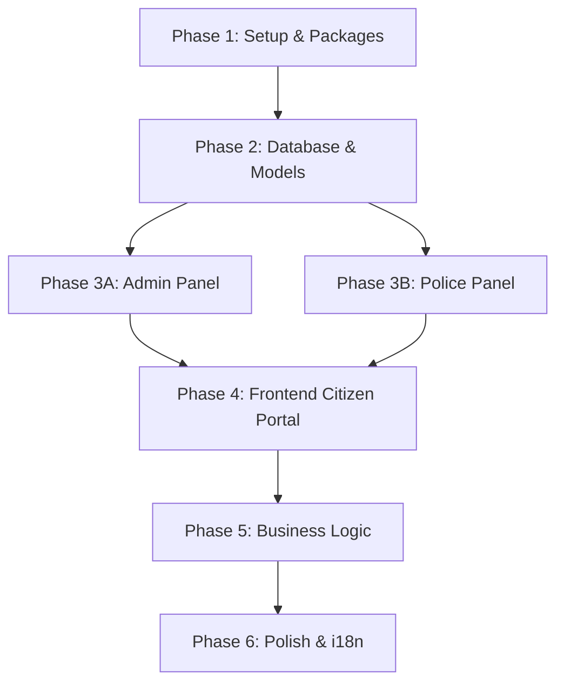

# 🚦 Traffic Reports & Road Safety System — Implementation Plan

## Project Overview

بناء نظام ويب متكامل لبلاغات المرور والسلامة على الطرق باستخدام Laravel 12 + FilamentPHP v3 + Tailwind CSS + Alpine.js. المشروع حالياً عبارة عن Laravel 12 فارغ (fresh install) بدون أي كود مخصص.

> [!IMPORTANT]
> المشروع يتطلب بناء كامل من الصفر — لا يوجد أي Models أو Migrations أو Views مخصصة حالياً.

---

## Phase 1: Setup & Core Packages (الإعداد والحزم الأساسية)

### الهدف
تثبيت وإعداد جميع الحزم المطلوبة وتكوين البيئة الأساسية.

### الأوامر المطلوبة
```bash
composer require filament/filament:"^3.3" -W
composer require spatie/laravel-permission
composer require mcamara/laravel-localization
php artisan filament:install --panels
php artisan vendor:publish --provider="Spatie\Permission\PermissionServiceProvider"
php artisan vendor:publish --provider="Mcamara\LaravelLocalization\LaravelLocalizationServiceProvider"
```

### الملفات المطلوب تعديلها

#### [MODIFY] [.env](file:///d:/Tecjno-Injaz/traffic_app/.env)
- إضافة `APP_LOCALE=en`, `APP_FALLBACK_LOCALE=en`
- تأكد من إعدادات قاعدة البيانات `traffic_app`

#### [MODIFY] [config/app.php](file:///d:/Tecjno-Injaz/traffic_app/config/app.php)
- إعداد `locale`, `fallback_locale`, `available_locales`

#### [NEW] `config/laravellocalization.php`
- تفعيل `ar` و `en` فقط
- إعداد `hideDefaultLocaleInURL = true`

#### [MODIFY] [app/Http/Kernel.php](file:///d:/Tecjno-Injaz/traffic_app/app/Http) أو `bootstrap/app.php`
- إضافة middleware الخاص بالترجمة

---

## Phase 2: Database, Models & Seeders (قاعدة البيانات)

### 2A: Migrations (7 ملفات)

#### [MODIFY] `database/migrations/0001_01_01_000000_create_users_table.php`
- إضافة `role_id`, `username`, `is_active` لجدول users
- حذف `name` واستبداله بـ `username`

#### [NEW] الملفات التالية:
| Migration | الجدول | الحقول الرئيسية |
|-----------|--------|-----------------|
| `create_roles_table.php` | `roles` | `name`, `slug` (unique) |
| `create_citizens_data_table.php` | `citizens_data` | `user_id` (unique), `national_id`, `full_name`, `phone`, `blood_type` |
| `create_police_data_table.php` | `police_data` | `user_id` (unique), `badge_number`, `full_name`, `rank`, `department` (enum) |
| `create_admins_data_table.php` | `admins_data` | `user_id` (unique), `full_name` |
| `create_vehicles_table.php` | `vehicles` | `citizen_id`, `plate_number` (unique), `vehicle_type`, `make`, `model_year`, `color` |
| `create_reports_table.php` | `reports` | `citizen_id`, `vehicle_id`, `assigned_department` (enum), `report_type`, `description`, `latitude`, `longitude`, `location_text`, `image_url`, `status` (enum) + indexes على `latitude`, `longitude`, `status` |
| `create_activity_logs_table.php` | `activity_logs` | `admin_id`, `action_type`, `target_table`, `description` |

### 2B: Enums (2 ملفات)

#### [NEW] `app/Enums/Department.php`
- Cases: `highway_patrol`, `traffic_police`, `local_police`

#### [NEW] `app/Enums/ReportStatus.php`
- Cases: `new`, `in_progress`, `resolved`, `rejected`

### 2C: Models (7 ملفات)

| Model | العلاقات | ملاحظات |
|-------|----------|---------|
| [MODIFY] `User.php` | `belongsTo(Role)`, `hasOne(CitizenData)`, `hasOne(PoliceData)`, `hasOne(AdminData)` | إضافة `role_id`, `username`, `is_active` إلى `$fillable` |
| [NEW] `Role.php` | `hasMany(User)` | |
| [NEW] `CitizenData.php` | `belongsTo(User)`, `hasMany(Vehicle)`, `hasMany(Report)` | |
| [NEW] `PoliceData.php` | `belongsTo(User)` | Cast `department` → `Department` enum |
| [NEW] `AdminData.php` | `belongsTo(User)`, `hasMany(ActivityLog)` | |
| [NEW] `Vehicle.php` | `belongsTo(CitizenData)`, `hasMany(Report)` | |
| [NEW] `Report.php` | `belongsTo(CitizenData)`, `belongsTo(Vehicle)` | Cast `status` → `ReportStatus`, cast `assigned_department` → `Department` |
| [NEW] `ActivityLog.php` | `belongsTo(AdminData)` | |

### 2D: Factories & Seeders

#### [NEW] `database/factories/` — Factory لكل Model
#### [MODIFY] `database/seeders/DatabaseSeeder.php`
- 3 Roles: `citizen`, `admin`, `police`
- 1 Super Admin + AdminData
- 3 Police Officers (واحد لكل department) + PoliceData
- 5 Citizens + CitizenData
- 10 Vehicles مرتبطة بالمواطنين
- 50 Report مع إحداثيات GPS واقعية

---

## Phase 3: Filament Panels (لوحات الإدارة)

### 3A: Admin Panel (`/admin`)

#### [NEW] `app/Providers/Filament/AdminPanelProvider.php`
- المسار: `/admin`
- التحقق: فقط المستخدمين بـ `role.slug = 'admin'`
- تفعيل Dark Mode

#### Resources (4 ملفات):

| Resource | الصلاحيات | ملاحظات |
|----------|----------|---------|
| [NEW] `UserResource` | CRUD كامل | RelationManager لـ CitizenData/PoliceData |
| [NEW] `VehicleResource` | قراءة فقط | بحث بـ `plate_number` |
| [NEW] `ReportResource` | قراءة فقط | عرض جميع البلاغات |
| [NEW] `ActivityLogResource` | قراءة فقط | سجل المراجعة |

#### Widgets (2 ملفات):

| Widget | النوع | المحتوى |
|--------|------|---------|
| [NEW] `StatsOverview` | Stats | إجمالي المستخدمين، البلاغات، البلاغات غير المحلولة |
| [NEW] `ReportsChart` | Chart | مخطط خطي للبلاغات شهرياً |

### 3B: Police Panel (`/police`)

#### [NEW] `app/Providers/Filament/PolicePanelProvider.php`
- المسار: `/police`
- التحقق: فقط `role.slug = 'police'`

#### [NEW] `app/Models/Scopes/DepartmentScope.php`
- Global Scope يُقيّد البلاغات حسب `department` الضابط المسجل

#### Resources:

| Resource | الصلاحيات | ملاحظات |
|----------|----------|---------|
| [NEW] `AssignedReportResource` | تعديل `status` فقط | Status Badges ملونة، فلاتر بالحالة والتاريخ |

#### Relation Managers:
| Manager | داخل | المحتوى |
|---------|------|---------|
| [NEW] `VehicleRelationManager` | `AssignedReportResource` | عرض تفاصيل المركبة المرتبطة |

---

## Phase 4: Frontend — Citizen Portal (واجهة المواطن)

### 4A: Layout & Components

#### [NEW] `resources/views/layouts/app.blade.php`
- Navbar متجاوب مع Language Switcher (AR/EN) + Dark Mode Toggle
- Footer
- دعم RTL/LTR عبر `dir` attribute

#### [NEW] `resources/views/components/`
- `navbar.blade.php`, `footer.blade.php`, `language-switcher.blade.php`, `dark-mode-toggle.blade.php`

### 4B: Auth Pages

#### [NEW] `resources/views/auth/login.blade.php`
#### [NEW] `resources/views/auth/register.blade.php`
- يجمع بيانات `CitizenData` أثناء التسجيل (`national_id`, `full_name`, `phone`, `blood_type`)

#### [NEW] Controllers:
- `app/Http/Controllers/Auth/LoginController.php`
- `app/Http/Controllers/Auth/RegisterController.php`
- `app/Http/Requests/RegisterRequest.php`

### 4C: Citizen Dashboard

#### [NEW] `resources/views/citizen/dashboard.blade.php`
- **تبويب المركبات:** CRUD مع جدول مُرقّم + بحث
- **تبويب بلاغاتي:** قائمة بلاغات المواطن مع Status Badges + بحث + ترقيم

#### [NEW] Controllers:
- `app/Http/Controllers/Citizen/DashboardController.php`
- `app/Http/Controllers/Citizen/VehicleController.php`
- `app/Http/Controllers/Citizen/ReportController.php`

### 4D: Smart Reporting Wizard (الميزة الأساسية)

#### [NEW] `resources/views/citizen/report-wizard.blade.php`
- Multi-step form باستخدام Alpine.js (`x-data="{ step: 1 }"`)
- **الخطوة 1:** اختيار نوع البلاغ (حادث، خطر، ازدحام) + التقاط GPS تلقائي
- **الخطوة 2:** اختيار المركبة + رفع صورة + وصف نصي
- **الخطوة 3:** مراجعة وإرسال
- تصميم يشبه تطبيقات الموبايل الحديثة

### 4E: Routes

#### [MODIFY] [routes/web.php](file:///d:/Tecjno-Injaz/traffic_app/routes/web.php)
```
/ → الصفحة الرئيسية
/login, /register → صفحات التسجيل
/citizen/dashboard → لوحة المواطن
/citizen/vehicles → CRUD المركبات
/citizen/reports → بلاغاتي
/citizen/reports/create → معالج البلاغ الذكي
```

---

## Phase 5: Business Logic — Smart Auto-Routing

### [NEW] `app/Services/ReportCreationService.php`
منطق التوجيه الذكي:
- `accident` أو `hazard` خارج حدود المدينة → `highway_patrol`
- `traffic_jam` → `traffic_police`
- `security_threat` → `local_police`

### [NEW] `app/Events/ReportCreated.php`
### [NEW] `app/Listeners/LogReportCreation.php`
- تسجيل في `activity_logs` عند إنشاء بلاغ جديد

#### [NEW] `app/Http/Requests/StoreReportRequest.php`
- Form Request للتحقق من صحة بيانات البلاغ

---

## Phase 6: Localization & Final Polish

### [NEW] `lang/en/messages.php` — جميع النصوص بالإنجليزية
### [NEW] `lang/ar/messages.php` — جميع النصوص بالعربية
### [NEW] `lang/ar/filament.php` — ترجمة Filament للعربية
### [NEW] `lang/en/validation.php` و `lang/ar/validation.php`

### التأكد من:
- Dark Mode يعمل على جميع الصفحات
- RTL يعمل بشكل صحيح مع العربية
- جميع الجداول تدعم: بحث، ترتيب، فلاتر، ترقيم
- رسائل التحقق بلغتين

---

## ملخص الملفات المطلوبة

| الفئة | عدد الملفات الجديدة | عدد الملفات المُعدّلة |
|-------|---------------------|----------------------|
| Migrations | 7 | 1 |
| Enums | 2 | 0 |
| Models | 7 | 1 (User.php) |
| Factories | 7 | 0 |
| Seeders | 1 | 1 |
| Filament Panels | 2 | 0 |
| Filament Resources | 5 | 0 |
| Filament Widgets | 2 | 0 |
| Scopes | 1 | 0 |
| Controllers | 5 | 0 |
| Form Requests | 2 | 0 |
| Services | 1 | 0 |
| Events/Listeners | 2 | 0 |
| Blade Views | ~10 | 0 |
| Lang Files | ~6 | 0 |
| Config | 1 | 2 |
| Routes | 0 | 1 |
| **الإجمالي** | **~61 ملف جديد** | **~6 ملفات معدّلة** |

---

## Verification Plan (خطة التحقق)

### Automated Tests
```bash
php artisan migrate:fresh --seed    # التحقق من قاعدة البيانات
php artisan test                     # تشغيل الاختبارات
```

### Manual Verification
1. **Admin Panel**: الدخول على `/admin` بحساب Admin → التأكد من الـ Resources و Widgets
2. **Police Panel**: الدخول على `/police` بحساب شرطي → التأكد أنه يرى فقط بلاغات قسمه
3. **Citizen Portal**: تسجيل مواطن جديد → إضافة مركبة → إنشاء بلاغ عبر الـ Wizard
4. **التوجيه الذكي**: إنشاء بلاغات بأنواع مختلفة والتأكد من التوجيه الصحيح
5. **الترجمة**: التبديل بين AR/EN والتأكد من RTL/LTR
6. **Dark Mode**: التبديل والتأكد من جميع الصفحات
7. **Browser Testing**: اختبار في المتصفح لجميع الصفحات

---

## ترتيب التنفيذ المقترح



> [!NOTE]
> كل Phase تعتمد على السابقة. Phase 3A و 3B يمكن تنفيذهما بالتوازي بعد Phase 2.
